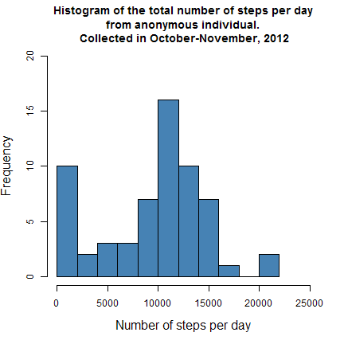
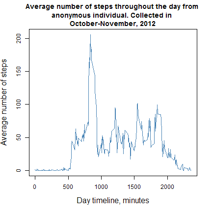
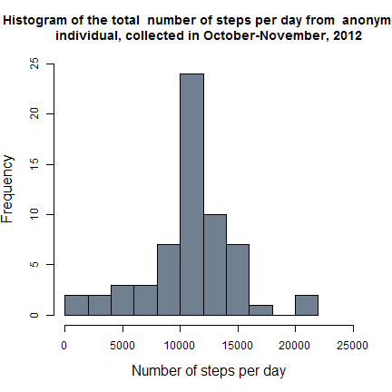
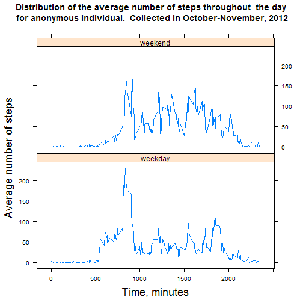

# Reproducible Research: Peer Assessment 1


## Loading and preprocessing the data

We load and transform data into a format with appropriate data classes.


```r
if (!file.exists("activity.csv")) {
    unzip("activity.zip", overwrite = FALSE)
}
data <- read.table("activity.csv", header = TRUE, sep = ",", colClasses = c("numeric", 
    "character", "numeric"), na.strings = "NA", nrows = 17569, allowEscapes = TRUE, 
    quote = "\"")
data$date <- as.Date(data$date, format = "%Y-%m-%d")
str(data)
```

```
## 'data.frame':	17568 obs. of  3 variables:
##  $ steps   : num  NA NA NA NA NA NA NA NA NA NA ...
##  $ date    : Date, format: "2012-10-01" "2012-10-01" ...
##  $ interval: num  0 5 10 15 20 25 30 35 40 45 ...
```


## What is mean total number of steps taken per day?

In order to obtain mean and median number of steps per day, at first we sum 
data for all 5 minute intervals for each date. Then we calculate mean, median, 
and build a histogram of the total number of steps per day in October and 
November 2012.


```r
day_summary <- tapply(data$steps, data$date, sum, na.rm = TRUE)
mean(day_summary)
```

```
## [1] 9354
```

```r
median(day_summary)
```

```
## [1] 10395
```


```r
hist(day_summary, breaks = 15, xlim = c(0, 25000), ylim = c(0, 20), cex.lab = 1.3, 
    xlab = "Number of steps per day", col = "steelblue", main = paste("Histogram of the total number of steps", 
        "per day\n from anonymous individual. \n", "Collected in October-November, 2012"))
```

 


## What is the average daily activity pattern?

At this step we calculate the average number of steps taken for each 5 minute 
time interval throughout a day.


```r
time_summary <- tapply(data$steps, data$interval, mean, na.rm = TRUE)
plot(as.numeric(names(time_summary)), time_summary, type = "l", cex.lab = 1.3, 
    ylab = "Average number of steps", xlab = "Day timeline, minutes", col = "steelblue", 
    main = paste("Average number of steps throughout the day", "from \n anonymous individual. Collected in", 
        " \nOctober-November, 2012"))
```

 


Now we look for the 5 minute time interval where the number of steps is maximal 
on average throughout the day.


```r
max_steps <- as.numeric(names(which.max(time_summary)))
max_steps_hours <- max_steps%/%60
max_steps_minutes <- max_steps%%60
```


The maximal average number of steps is for 835 minutes time interval, 
which corresponds time between 13:50 
and 13:55.


## Imputing missing values

We calculate the total number of missing values in the dataset (i.e. the total 
number of rows with NAs).


```r
sum(!complete.cases(data))
```

```
## [1] 2304
```


We have 2304 rows with NA in dataset. 

Now we are creating a new dataset that is equal to the original dataset but with 
the missing data filled in with mean for 5-minute interval that corresponds to 
missing value.


```r
data_filled <- data
for (x in 1:length(data_filled$steps)) {
    if (is.na(data_filled$steps[x])) {
        data_filled$steps[x] = time_summary[as.character(data_filled$interval[x])][[1]]
    }
}
head(data)
```

```
##   steps       date interval
## 1    NA 2012-10-01        0
## 2    NA 2012-10-01        5
## 3    NA 2012-10-01       10
## 4    NA 2012-10-01       15
## 5    NA 2012-10-01       20
## 6    NA 2012-10-01       25
```

```r
head(data_filled)
```

```
##     steps       date interval
## 1 1.71698 2012-10-01        0
## 2 0.33962 2012-10-01        5
## 3 0.13208 2012-10-01       10
## 4 0.15094 2012-10-01       15
## 5 0.07547 2012-10-01       20
## 6 2.09434 2012-10-01       25
```


We again calculate mean, median, and build a histogram of the total number of 
steps per day, but this time for dataset with filled NAs. 


```r
day_summary <- tapply(data_filled$steps, data_filled$date, sum, na.rm = TRUE)
mean(day_summary)
```

```
## [1] 10766
```

```r
median(day_summary)
```

```
## [1] 10766
```


```r
hist(day_summary, breaks = 15, cex.lab = 1.3, ylim = c(0, 25), xlim = c(0, 25000), 
    xlab = "Number of steps per day", col = "slategrey", main = paste("Histogram of the total ", 
        "number of steps per day from ", "anonymous\n individual, collected in October-November, 2012 "))
```

 


As we can see, this graph differ significantly from the histogram for global 
average number of steps without removed NAs. Now we can see no peak at 0 and
significantly higher main peak. Also removing NA makes mean and median equal. 
This also differ from the first histogram and it is due to the fact that we 
removed skew of distribution.


## Are there differences in activity patterns between weekdays and weekends?

Now lets exemine if the pattern of number of steps is differ for weekdays and 
weekends. At first we create a new variable weekday, which is factor with two 
levels “weekday” and “weekend”.


```r
weekday <- factor(as.POSIXlt(data_filled$date)$wday == 0 | as.POSIXlt(data_filled$date)$wday == 
    6, labels = c("weekday", "weekend"))
data_filled$weekday <- weekday
str(data_filled)
```

```
## 'data.frame':	17568 obs. of  4 variables:
##  $ steps   : num  1.717 0.3396 0.1321 0.1509 0.0755 ...
##  $ date    : Date, format: "2012-10-01" "2012-10-01" ...
##  $ interval: num  0 5 10 15 20 25 30 35 40 45 ...
##  $ weekday : Factor w/ 2 levels "weekday","weekend": 1 1 1 1 1 1 1 1 1 1 ...
```


Now we are making a panel plot containing a time series plot of the 5-minute 
interval and the average number of steps taken, averaged across all weekday 
days or weekend days.


```r
head(data_filled)
```

```
##     steps       date interval weekday
## 1 1.71698 2012-10-01        0 weekday
## 2 0.33962 2012-10-01        5 weekday
## 3 0.13208 2012-10-01       10 weekday
## 4 0.15094 2012-10-01       15 weekday
## 5 0.07547 2012-10-01       20 weekday
## 6 2.09434 2012-10-01       25 weekday
```

```r
agg <- aggregate(data_filled$steps, by = list(data_filled$interval, data_filled$weekday), 
    FUN = mean)
colnames(agg) <- c("interval", "weekday", "steps")
head(agg)
```

```
##   interval weekday   steps
## 1        0 weekday 2.25115
## 2        5 weekday 0.44528
## 3       10 weekday 0.17317
## 4       15 weekday 0.19790
## 5       20 weekday 0.09895
## 6       25 weekday 1.59036
```

```r
library(lattice)
xyplot(steps ~ interval | weekday, data = agg, layout = c(1, 2), type = "l", 
    xlab = list(label = "Time, minutes", cex = 1.5), ylab = list(label = "Average number of steps", 
        cex = 1.5), main = paste("Distribution of the average number of steps throughout ", 
        "the day\n for anonymous individual. ", "Collected in October-November, 2012"))
```

 


As we can see, there are different moving patterns for weekend and weekdays. 
On weekdays average number of steps is higher in the morning and lower in the 
rest of the day comparing to weekends.


The data was provided by Reproducible Research courses, Coursera.
Fork from [rdpeng](https://github.com/rdpeng/RepData_PeerAssessment1)
